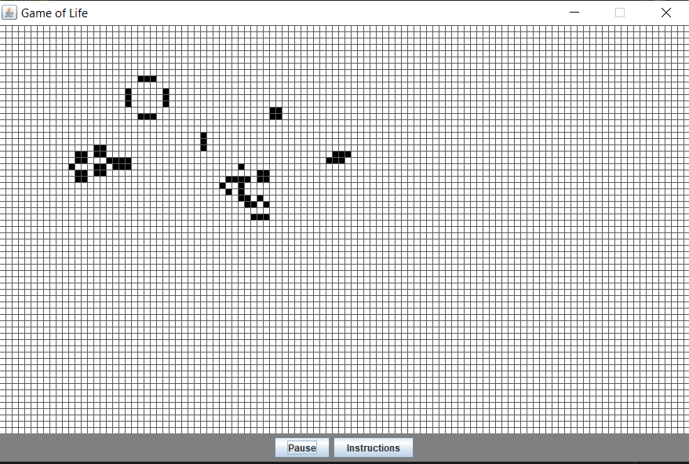

# swing-gameoflife
An older project made in 2017 based on Conway's Game of life using Java swing for rendering.

<h3> Usage:</h3>
Download "life.jar" in the releases section of the github page, then unzip the folder once it is downloaded. If the file doesnt run by double clicking it, try running
the program from console using "java -jar life.jar" in the same directory as the jar.

